# ML-FREF: Consolidated Results (final)

Generated by `scripts/build_results_final.py` from the genuine pilot outputs in `results/chapter4/` (per-value sources: `results/chapter4/results_provenance.csv`). The synthetic demonstration set in `results/synthetic/` is **not** used anywhere in this document. Commit of all pilot runs: 5eb0bec, cb19c8f; reconstruction engine v1.1 (see §11).

## 1. Key results at a glance

| Measure (pilot, 5 % poisoning, 30 epochs) | A conventional | B provenance | C forensic-ready |
|---|---|---|---|
| Clean test accuracy, all runs (n = 6 each) | 0.9217 ± 0.0159 | 0.9217 ± 0.0159 | 0.9217 ± 0.0159 |
| Evidence completeness, attacked runs (n = 4) | 50.0 % | 70.0 % | 100.0 % |
| Event recovery rate, attacked runs (n = 4) | 0.866 ± 0.010 | 1.000 ± 0.000 | 1.000 ± 0.000 |
| Timeline ordering, Kendall τ-b (n = 6) | 1.000 ± 0.000 | 1.000 ± 0.000 | 1.000 ± 0.000 |
| Root-cause identification score, attacked (n = 4) | 0.75 ± 0.00 | 0.75 ± 0.00 | 1.00 ± 0.00 |
| Root-cause finding (attacked runs) | INSUFFICIENT_EVIDENCE | DATASET_MODIFIED_UNSPECIFIED | CONTENT_AND_LABEL_MODIFICATION, LABEL_MODIFICATION |
| Reconstruction time, median (s), n = 6 | 0.215 | 0.376 | 0.410 |
| Evidence storage incl. MLflow model copy (MB) | 0.055 ± 0.000 | 42.762 ± 0.000 | 52.364 ± 2.756 |
| Training-time difference vs matched A (%) | 0.0 ± 0.0 | -0.8 ± 5.8 | 3.4 ± 5.5 |

- **Instrumentation did not change training:** for every condition and seed, A, B and C reached identical clean accuracy.
- **Only C identified the poisoned samples.** Its changed-sample set equalled the true poisoned set, with precision = recall = F1 = 1.0 in all 4 attacked runs.
- **B detected that the training data had changed but not which samples.** A could not observe the change at all.
- **No clean-control investigation attributed a modification** in any pipeline.
- **Training-time difference vs matched A:** B -0.8 %, C 3.4 %. C's extra evidence costs 9.6 MB per run beyond B; MLflow's logged model copy adds 42.7 MB to B and C.
- **Statistics are exploratory** (6 blocks). No pairwise difference survives Holm correction (§10).

## 2. Study conditions and assumptions (brief)

- **Design:** one shared ML pipeline; the only independent variable is evidence instrumentation: A = application log only; B = A + MLflow tracking (runs, params, metrics, dataset digests and label profiles, registered model); C = B + forensic SQLite store (hash-chained events, SHA-256 artefact hashes, per-sample manifests, deployment/inference events, integrity checks).
- **Matrix (pilot):** {clean control, label flip 5 %, backdoor 5 %} × {A, B, C} × seeds {1, 2} = 18 runs; ResNet-18 (CIFAR stem), CIFAR-10 (50,000 train / 10,000 test), 30 epochs, SGD lr 0.1, batch 128, cosine schedule, AMP fp16 (D-025, D-027).
- **Threat model:** data-store tampering. The clean data is registered, the adversary modifies the stored copy outside the pipeline, and training then reads the tampered store (D-015). The attack is covert: no attack information appears in evidence (D-014, D-021).
- **Label flip:** 2,500 automobile images (5 % of the whole training set = 50 % of the class) relabelled as truck (D-028).
- **Backdoor:** a 3×3 black/white checkerboard at the bottom right (rows/cols 28–30) stamped on 2,500 non-airplane training images, which are relabelled as airplane. ASR = triggered non-airplane test images predicted as airplane / 9,000.
- **Traffic and incident:** 200 inference requests per run, identical across A/B/C; backdoor runs include 10 attacker-submitted triggered images. The incident ticket is the first request whose prediction meets the attack objective (clean runs: the first misclassification). It contains observable facts only (D-041, D-042).
- **Reconstruction:** one engine for all pipelines, reading only that pipeline's evidence and the ticket. Links are rated STRONG, MODERATE, WEAK or NONE (§7). The engine never reads ground truth (enforced by tests).
- **Evaluation:** against ground truth using the schema frozen before the pilot (commit 96a509d): 5 s time tolerance; the strongest reference present decides the artefact match; path-only references are scored as 'content at event time' (D-054); Kendall τ needs ≥ 4 events; poisoning source counts as identified at F1 ≥ 0.90.
- **Engine version:** results use reconstruction engine v1.1, after a pilot-detected defect in how B's registration run was linked (D-060/D-061, §11).
- **GPU power state:** the first 6 runs (clean and label flip, seed 1) ran with the laptop GPU power-limited (median epoch ≈ 32 s versus ≈ 21.5 s). Each A/B/C triple shared one power state.

## 3. Experimental environment

| Item | Value |
|---|---|
| Operating system | Windows 11 (10.0.26100) |
| Python | 3.14.3 |
| PyTorch | 2.14.0+cu130 |
| torchvision | 0.29.0+cu130 |
| CUDA (PyTorch build) | 13.0 |
| cuDNN | 92400 |
| GPU | NVIDIA RTX 1000 Ada Generation Laptop GPU |
| GPU memory (MB) | 6140 |
| CPU | Intel(R) Core(TM) Ultra 7 165H |
| CPU cores (physical/logical) | 16/22 |
| System RAM (GB) | 31.5 |
| MLflow | 3.16.1 |
| NumPy | 2.5.2 |
| pandas | 3.0.6 |
| scikit-learn | 1.9.1 |
| SciPy | 1.18.1 |
| Git commit of all pilot runs | 5eb0bec, cb19c8f |
| Git branch | main |
| Git working tree clean at run start | False |
| Clean dataset manifest SHA-256 (CIFAR10-CLEAN-V1) | f7285605e556be1f453be1f05ea295de43e5e5a1c1d01b7de8d3f449dedb1649 |
| Evaluation schema | FROZEN; freeze commit 96a509d (recorded as 9bccbc0 pre-rewrite) |

## 4. Experiment inventory

| Experiment | Pipeline | Attack | Seed | Status | GPU power state | Median epoch (s) | Retry |
|---|---|---|---|---|---|---|---|
| EXP-BD-A-05-S001 | A | BD | 1 | SUCCESS | full-power | 23.4 | NO |
| EXP-BD-A-05-S002 | A | BD | 2 | SUCCESS | full-power | 22.9 | NO |
| EXP-BD-B-05-S001 | B | BD | 1 | SUCCESS | full-power | 25.2 | NO |
| EXP-BD-B-05-S002 | B | BD | 2 | SUCCESS | full-power | 22.8 | YES (after failed attempt) |
| EXP-BD-C-05-S001 | C | BD | 1 | SUCCESS | full-power | 23.0 | NO |
| EXP-BD-C-05-S002 | C | BD | 2 | SUCCESS | reduced-power | 27.2 | NO |
| EXP-CLEAN-A-00-S001 | A | CLEAN | 1 | SUCCESS | full-power | 22.6 | NO |
| EXP-CLEAN-A-00-S002 | A | CLEAN | 2 | SUCCESS | full-power | 21.9 | NO |
| EXP-CLEAN-B-00-S001 | B | CLEAN | 1 | SUCCESS | full-power | 22.2 | NO |
| EXP-CLEAN-B-00-S002 | B | CLEAN | 2 | SUCCESS | full-power | 22.2 | NO |
| EXP-CLEAN-C-00-S001 | C | CLEAN | 1 | SUCCESS | full-power | 22.3 | NO |
| EXP-CLEAN-C-00-S002 | C | CLEAN | 2 | SUCCESS | full-power | 22.3 | NO |
| EXP-LF-A-05-S001 | A | LF | 1 | SUCCESS | full-power | 23.9 | NO |
| EXP-LF-A-05-S002 | A | LF | 2 | SUCCESS | full-power | 23.6 | NO |
| EXP-LF-B-05-S001 | B | LF | 1 | SUCCESS | full-power | 21.8 | YES (after failed attempt) |
| EXP-LF-B-05-S002 | B | LF | 2 | SUCCESS | full-power | 22.5 | YES (after failed attempt) |
| EXP-LF-C-05-S001 | C | LF | 1 | SUCCESS | full-power | 22.3 | NO |
| EXP-LF-C-05-S002 | C | LF | 2 | SUCCESS | full-power | 22.9 | NO |
| EXP-LF-B-05-S001 |  |  |  | FAILED at stage 'attack' (PermissionError) |  | – | retried; retry completed |
| EXP-LF-B-05-S002 |  |  |  | FAILED at stage 'attack' (PermissionError) |  | – | retried; retry completed |
| EXP-BD-B-05-S002 |  |  |  | FAILED at stage 'attack' (PermissionError) |  | – | retried; retry completed |
| EXP-LF-B-05-S001 |  |  |  | FAILED at stage 'attack' (PermissionError) |  | – | retried; retry completed |

Totals: 18 completed pilot runs (all used in analysis); 1 failed attempt (EXP-BD-C-05-S002, transient Windows `PermissionError` while writing the data store at the attack stage), which was retried successfully and is kept in `results/raw/failed_runs.csv` (D-059). Earlier preliminary runs are listed in §12.

## 5. Model performance and attack effectiveness (manipulation checks)

### 5.1 Clean control runs

| Experiment | Pipeline | Seed | Clean test acc. | Final train loss | Final train acc. | Training (s) | Model size (MB) | Model SHA-256 (prefix) | Peak RAM (MB) | Peak GPU (MB) |
|---|---|---|---|---|---|---|---|---|---|---|
| EXP-CLEAN-A-00-S001 | A | 1 | 0.9334 | 0.0270 | 0.9929 | 740.5 | 42.70 | a57d5e956120 | 2158.3 | 765.5 |
| EXP-CLEAN-A-00-S002 | A | 2 | 0.9284 | 0.0321 | 0.9911 | 712.7 | 42.70 | 3a07aa1253ef | 2153.8 | 765.5 |
| EXP-CLEAN-B-00-S001 | B | 1 | 0.9334 | 0.0270 | 0.9929 | 738.0 | 42.70 | a57d5e956120 | 2160.0 | 765.5 |
| EXP-CLEAN-B-00-S002 | B | 2 | 0.9284 | 0.0321 | 0.9911 | 711.9 | 42.70 | 3a07aa1253ef | 2085.7 | 765.5 |
| EXP-CLEAN-C-00-S001 | C | 1 | 0.9334 | 0.0270 | 0.9929 | 715.2 | 42.70 | a57d5e956120 | 2121.6 | 765.5 |
| EXP-CLEAN-C-00-S002 | C | 2 | 0.9284 | 0.0321 | 0.9911 | 724.7 | 42.70 | 3a07aa1253ef | 2087.6 | 765.5 |

For every condition and seed, A, B and C produced **bit-identical models** (same SHA-256), so instrumentation did not affect training. The clean seed-1 pilot model (a57d5e95...) is identical to the clean baseline trained with the separate clean-baseline script (section 12).

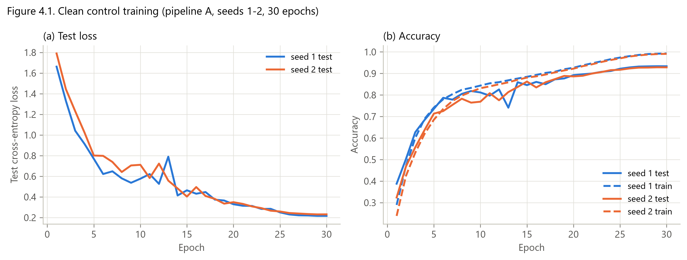

*Figure 4.1. Clean control training curves (pipeline A, seeds 1–2, 30 epochs)*

### 5.2 Label flipping (5 %)

| Experiment | Pipeline | Seed | Poisoned | Poison % of train set | As intended | Clean test acc. | Automobile→truck error | Training (s) | Model SHA-256 (prefix) |
|---|---|---|---|---|---|---|---|---|---|
| EXP-LF-A-05-S001 | A | 1 | 2500 | 5.0 | YES | 0.9011 | 0.3860 | 766.9 | 4d634c055d47 |
| EXP-LF-A-05-S002 | A | 2 | 2500 | 5.0 | YES | 0.9016 | 0.3820 | 764.1 | c09adc48df35 |
| EXP-LF-B-05-S001 | B | 1 | 2500 | 5.0 | YES | 0.9011 | 0.3860 | 714.0 | 4d634c055d47 |
| EXP-LF-B-05-S002 | B | 2 | 2500 | 5.0 | YES | 0.9016 | 0.3820 | 729.7 | c09adc48df35 |
| EXP-LF-C-05-S001 | C | 1 | 2500 | 5.0 | YES | 0.9011 | 0.3860 | 837.0 | 4d634c055d47 |
| EXP-LF-C-05-S002 | C | 2 | 2500 | 5.0 | YES | 0.9016 | 0.3820 | 808.1 | c09adc48df35 |

*Automobile→truck error = clean automobile test images predicted as truck / 1,000.*

### 5.3 Backdoor (5 %)

| Experiment | Pipeline | Seed | Poisoned | Trigger | Clean test acc. | ASR | Training (s) | Model SHA-256 (prefix) |
|---|---|---|---|---|---|---|---|---|
| EXP-BD-A-05-S001 | A | 1 | 2500 | 3x3 checkerboard, bottom_right rows [28, 31] cols [28, 31] | 0.9316 | 1.0000 | 766.1 | e7174af106f4 |
| EXP-BD-A-05-S002 | A | 2 | 2500 | 3x3 checkerboard, bottom_right rows [28, 31] cols [28, 31] | 0.9339 | 1.0000 | 778.9 | 1285deb1b912 |
| EXP-BD-B-05-S001 | B | 1 | 2500 | 3x3 checkerboard, bottom_right rows [28, 31] cols [28, 31] | 0.9316 | 1.0000 | 840.7 | e7174af106f4 |
| EXP-BD-B-05-S002 | B | 2 | 2500 | 3x3 checkerboard, bottom_right rows [28, 31] cols [28, 31] | 0.9339 | 1.0000 | 757.8 | 1285deb1b912 |
| EXP-BD-C-05-S001 | C | 1 | 2500 | 3x3 checkerboard, bottom_right rows [28, 31] cols [28, 31] | 0.9316 | 1.0000 | 749.8 | e7174af106f4 |
| EXP-BD-C-05-S002 | C | 2 | 2500 | 3x3 checkerboard, bottom_right rows [28, 31] cols [28, 31] | 0.9339 | 1.0000 | 851.4 | 1285deb1b912 |

*ASR denominator: 9,000 triggered test images (true class ≠ airplane).*

| Condition (mean of seeds) | Clean test accuracy | Attack metric |
|---|---|---|
| Clean control | 0.9309 ± 0.0035 | – |
| Label flip 5 % | 0.9013 ± 0.0004 | automobile→truck error 0.3840 ± 0.0028 |
| Backdoor 5 % | 0.9327 ± 0.0016 | ASR 1.0000 ± 0.0000 |

*(Values are identical for B and C.)*

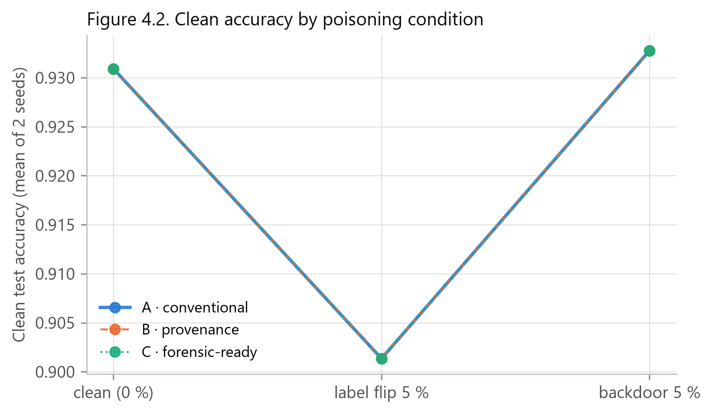

*Figure 4.2. Clean accuracy by poisoning condition (only one rate, 5 %, was tested)*

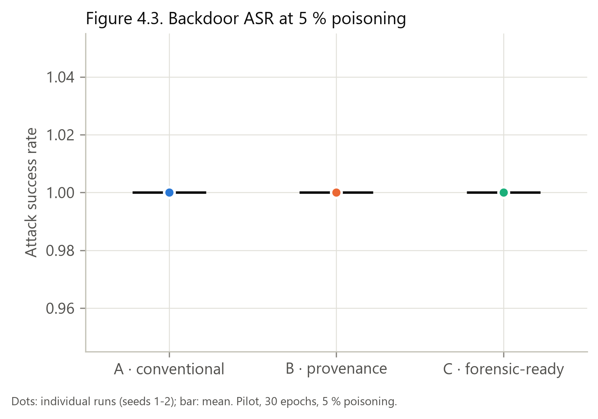

*Figure 4.3. Backdoor attack success rate at 5 % poisoning*

*Backdoor trigger: clean vs triggered training images (method illustration)*

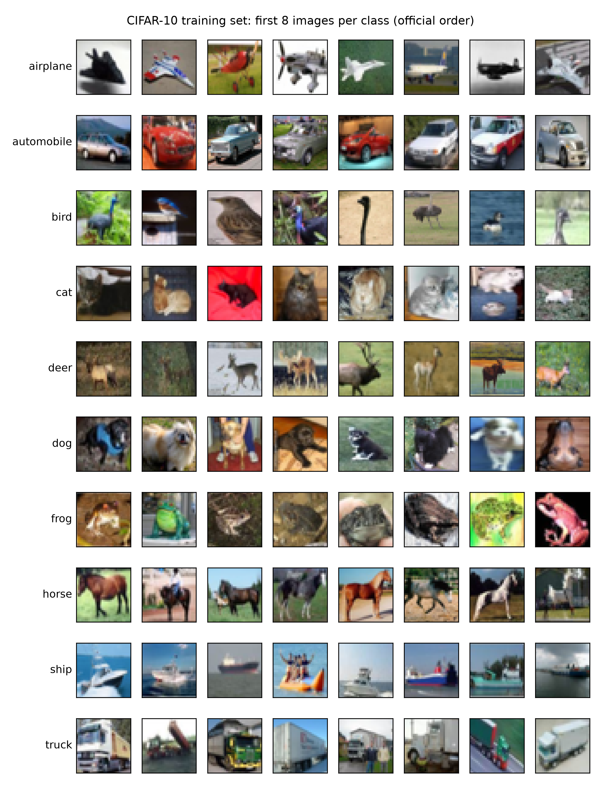

*CIFAR-10 training samples (dataset illustration)*

## 6. RQ1: Evidence availability and completeness

Evidence completeness (EC) = pre-registered evidence items recovered **and correct** / applicable items. There are 20 items; DS3 and DS5 (change lineage and changed samples) do not apply to clean runs, leaving 18.

| Evidence item | A | B | C |
|---|---|---|---|
| DS1: identity of dataset state used for training (ID or content hash) | YES | YES | YES |
| DS2: identity of an earlier registered dataset state | YES | YES | YES |
| DS3: lineage link between the two dataset states | NO | YES | YES |
| DS4: per-class profile of the training dataset | NO | YES | YES |
| DS5: sample-level description of the change (changed sample IDs) | NO | NO | YES |
| TR1: training run identity | NO | YES | YES |
| TR2: training start and end times | YES | YES | YES |
| TR3: link training run -> dataset used | YES | YES | YES |
| TR4: training hyper-parameters (epochs, batch size) correct | YES | YES | YES |
| TR5: code version (Git commit) of the training run | NO | YES | YES |
| MO1: identity of the model artefact (path, registry version or hash) | YES | YES | YES |
| MO2: cryptographic hash of the model recorded at creation | NO | NO | YES |
| MO3: link model -> training run | YES | YES | YES |
| DE1: deployment record: time and deployed model identity | YES | YES | YES |
| IN1: record of the ticketed request with its prediction | YES | YES | YES |
| IN2: link ticketed request -> deployed model | NO | NO | YES |
| IN3: identity (hash) of the submitted input | NO | NO | YES |
| IG1: dataset integrity check result at training time | NO | NO | YES |
| IG2: deployed model integrity check (deployed == trained) | YES | YES | YES |
| IG3: evidence-store integrity (hash chain verification) | NO | NO | YES |
| raw source: application log (app.log) | YES | YES | YES |
| raw source: artefact listing (artifacts.json) | YES | YES | YES |
| raw source: MLflow reference (mlflow_ref.json) | NO | YES | YES |
| raw source: forensic event store (forensic_evidence.sqlite) | NO | NO | YES |
| raw source: per-sample manifests (manifests/) | NO | NO | YES |
| raw source: JSONL evidence export | NO | NO | YES |

*YES = recovered and correct in every applicable pilot run of that pipeline; NO = in none; PARTIAL = in some; NOT APPLICABLE = no applicable run.*

### 6.1 Evidence completeness per run

| Experiment | Pipeline | Attack | Seed | Recovered / required | EC | Missing items |
|---|---|---|---|---|---|---|
| EXP-BD-A-05-S001 | A | BD | 1 | 10 / 20 | 50.0 % | DS3;DS4;DS5;TR1;TR5;MO2;IN2;IN3;IG1;IG3 |
| EXP-BD-B-05-S001 | B | BD | 1 | 14 / 20 | 70.0 % | DS5;MO2;IN2;IN3;IG1;IG3 |
| EXP-BD-C-05-S001 | C | BD | 1 | 20 / 20 | 100.0 % | none |
| EXP-BD-A-05-S002 | A | BD | 2 | 10 / 20 | 50.0 % | DS3;DS4;DS5;TR1;TR5;MO2;IN2;IN3;IG1;IG3 |
| EXP-BD-B-05-S002 | B | BD | 2 | 14 / 20 | 70.0 % | DS5;MO2;IN2;IN3;IG1;IG3 |
| EXP-BD-C-05-S002 | C | BD | 2 | 20 / 20 | 100.0 % | none |
| EXP-CLEAN-A-00-S001 | A | CLEAN | 1 | 10 / 18 | 55.6 % | DS4;TR1;TR5;MO2;IN2;IN3;IG1;IG3 |
| EXP-CLEAN-B-00-S001 | B | CLEAN | 1 | 13 / 18 | 72.2 % | MO2;IN2;IN3;IG1;IG3 |
| EXP-CLEAN-C-00-S001 | C | CLEAN | 1 | 18 / 18 | 100.0 % | none |
| EXP-CLEAN-A-00-S002 | A | CLEAN | 2 | 10 / 18 | 55.6 % | DS4;TR1;TR5;MO2;IN2;IN3;IG1;IG3 |
| EXP-CLEAN-B-00-S002 | B | CLEAN | 2 | 13 / 18 | 72.2 % | MO2;IN2;IN3;IG1;IG3 |
| EXP-CLEAN-C-00-S002 | C | CLEAN | 2 | 18 / 18 | 100.0 % | none |
| EXP-LF-A-05-S001 | A | LF | 1 | 10 / 20 | 50.0 % | DS3;DS4;DS5;TR1;TR5;MO2;IN2;IN3;IG1;IG3 |
| EXP-LF-B-05-S001 | B | LF | 1 | 14 / 20 | 70.0 % | DS5;MO2;IN2;IN3;IG1;IG3 |
| EXP-LF-C-05-S001 | C | LF | 1 | 20 / 20 | 100.0 % | none |
| EXP-LF-A-05-S002 | A | LF | 2 | 10 / 20 | 50.0 % | DS3;DS4;DS5;TR1;TR5;MO2;IN2;IN3;IG1;IG3 |
| EXP-LF-B-05-S002 | B | LF | 2 | 14 / 20 | 70.0 % | DS5;MO2;IN2;IN3;IG1;IG3 |
| EXP-LF-C-05-S002 | C | LF | 2 | 20 / 20 | 100.0 % | none |

### 6.2 Evidence completeness by pipeline

| Aggregate | n | Mean % | Median % | SD | Min | Max | 95 % CI |
|---|---|---|---|---|---|---|---|
| AGGREGATE A (all 6 runs) | 6 | 51.9 | 50.0 | 2.87 | 50.0 | 55.6 | 48.8–54.9 |
| AGGREGATE B (all 6 runs) | 6 | 70.7 | 70.0 | 1.15 | 70.0 | 72.2 | 69.5–71.9 |
| AGGREGATE C (all 6 runs) | 6 | 100.0 | 100.0 | 0.00 | 100.0 | 100.0 | 100.0–100.0 |
| AGGREGATE A (attacked, 4 runs) | 4 | 50.0 | 50.0 | 0.00 | 50.0 | 50.0 | 50.0–50.0 |
| AGGREGATE B (attacked, 4 runs) | 4 | 70.0 | 70.0 | 0.00 | 70.0 | 70.0 | 70.0–70.0 |
| AGGREGATE C (attacked, 4 runs) | 4 | 100.0 | 100.0 | 0.00 | 100.0 | 100.0 | 100.0–100.0 |

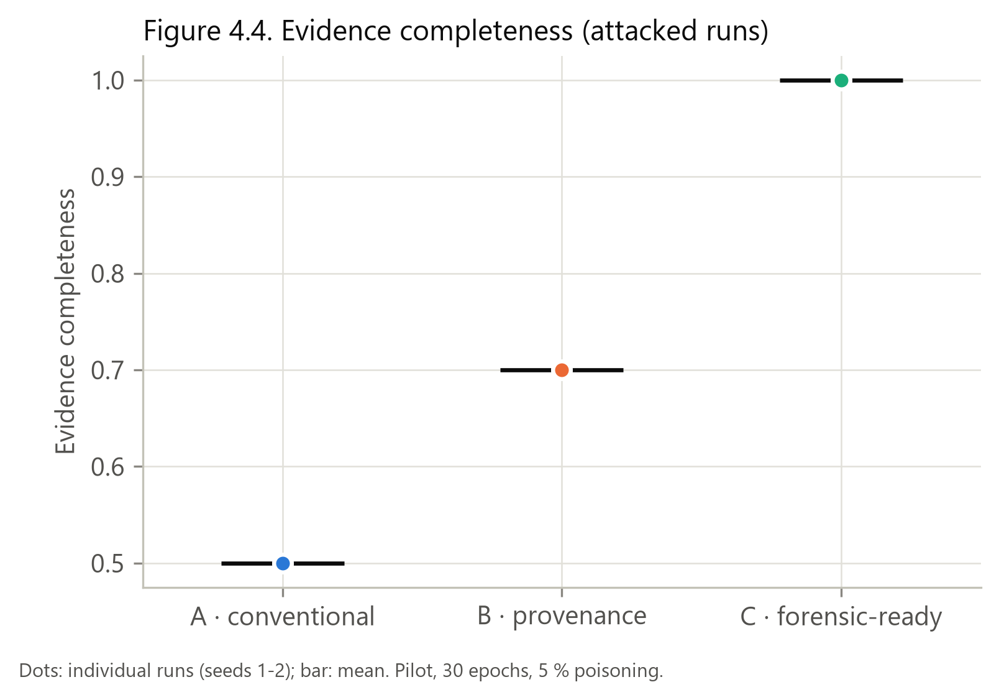

*Figure 4.4. Evidence completeness by pipeline (attacked runs; dots = runs)*

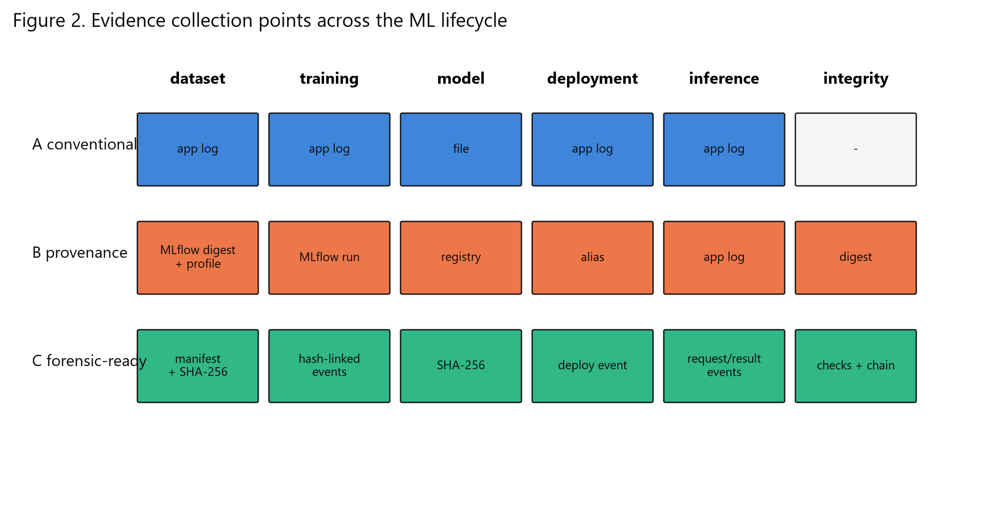

*Figure 2 (design). Evidence collection points across the ML lifecycle*

## 7. RQ2: Event recovery, timeline and evidence relationships

Event recovery rate (ERR) = required ground-truth events matched by a reconstructed event with the same class, the same artefact (strongest reference) and a time within 5 s / required events. Required events: clean runs 5 (dataset registered, training start/end, model, deployment); label flip 7 (+ poisoned dataset, malicious prediction); backdoor 8 (+ trigger submitted). The poisoning start/end instants are recorded but not scored.

| Experiment | Pipeline | Attack | Seed | Recovered / required | ERR | Missed events |
|---|---|---|---|---|---|---|
| EXP-BD-A-05-S001 | A | BD | 1 | 7 / 8 | 0.875 | POISONED_DATASET_CREATED (no reconstructed event of a matching class) |
| EXP-BD-B-05-S001 | B | BD | 1 | 8 / 8 | 1.000 | none |
| EXP-BD-C-05-S001 | C | BD | 1 | 8 / 8 | 1.000 | none |
| EXP-BD-A-05-S002 | A | BD | 2 | 7 / 8 | 0.875 | POISONED_DATASET_CREATED (no reconstructed event of a matching class) |
| EXP-BD-B-05-S002 | B | BD | 2 | 8 / 8 | 1.000 | none |
| EXP-BD-C-05-S002 | C | BD | 2 | 8 / 8 | 1.000 | none |
| EXP-CLEAN-A-00-S001 | A | CLEAN | 1 | 5 / 5 | 1.000 | none |
| EXP-CLEAN-B-00-S001 | B | CLEAN | 1 | 5 / 5 | 1.000 | none |
| EXP-CLEAN-C-00-S001 | C | CLEAN | 1 | 4 / 5 | 0.800 | CLEAN_DATASET_CREATED (time inconsistent) |
| EXP-CLEAN-A-00-S002 | A | CLEAN | 2 | 5 / 5 | 1.000 | none |
| EXP-CLEAN-B-00-S002 | B | CLEAN | 2 | 5 / 5 | 1.000 | none |
| EXP-CLEAN-C-00-S002 | C | CLEAN | 2 | 5 / 5 | 1.000 | none |
| EXP-LF-A-05-S001 | A | LF | 1 | 6 / 7 | 0.857 | POISONED_DATASET_CREATED (no reconstructed event of a matching class) |
| EXP-LF-B-05-S001 | B | LF | 1 | 7 / 7 | 1.000 | none |
| EXP-LF-C-05-S001 | C | LF | 1 | 7 / 7 | 1.000 | none |
| EXP-LF-A-05-S002 | A | LF | 2 | 6 / 7 | 0.857 | POISONED_DATASET_CREATED (no reconstructed event of a matching class) |
| EXP-LF-B-05-S002 | B | LF | 2 | 7 / 7 | 1.000 | none |
| EXP-LF-C-05-S002 | C | LF | 2 | 7 / 7 | 1.000 | none |

*Incorrectly inferred events are not measured by the implementation.*

| Aggregate | n | Mean | Median | SD | Min | Max |
|---|---|---|---|---|---|---|
| AGGREGATE A (all) | 6 | 0.911 | 0.875 | 0.070 | 0.857 | 1.000 |
| AGGREGATE B (all) | 6 | 1.000 | 1.000 | 0.000 | 1.000 | 1.000 |
| AGGREGATE C (all) | 6 | 0.967 | 1.000 | 0.082 | 0.800 | 1.000 |
| AGGREGATE A (attacked) | 4 | 0.866 | 0.866 | 0.010 | 0.857 | 0.875 |
| AGGREGATE B (attacked) | 4 | 1.000 | 1.000 | 0.000 | 1.000 | 1.000 |
| AGGREGATE C (attacked) | 4 | 1.000 | 1.000 | 0.000 | 1.000 | 1.000 |

### 7.1 Timeline reconstruction accuracy

Implemented as coverage (= ERR) plus ordering over the commonly recovered events: Kendall τ-b (scipy, only if ≥ 4 events) and pairwise order accuracy.

| Experiment | Pipeline | Recovered events | Correctly ordered pairs | Pairwise accuracy | Kendall τ-b | p |
|---|---|---|---|---|---|---|
| EXP-BD-A-05-S001 | A | 7 | 21 / 21 | 1.000 | 1.000 | 0.0004 |
| EXP-BD-B-05-S001 | B | 8 | 28 / 28 | 1.000 | 1.000 | 0.0000 |
| EXP-BD-C-05-S001 | C | 8 | 28 / 28 | 1.000 | 1.000 | 0.0000 |
| EXP-BD-A-05-S002 | A | 7 | 21 / 21 | 1.000 | 1.000 | 0.0004 |
| EXP-BD-B-05-S002 | B | 8 | 28 / 28 | 1.000 | 1.000 | 0.0000 |
| EXP-BD-C-05-S002 | C | 8 | 28 / 28 | 1.000 | 1.000 | 0.0000 |
| EXP-CLEAN-A-00-S001 | A | 5 | 10 / 10 | 1.000 | 1.000 | 0.0167 |
| EXP-CLEAN-B-00-S001 | B | 5 | 10 / 10 | 1.000 | 1.000 | 0.0167 |
| EXP-CLEAN-C-00-S001 | C | 4 | 6 / 6 | 1.000 | 1.000 | 0.0833 |
| EXP-CLEAN-A-00-S002 | A | 5 | 10 / 10 | 1.000 | 1.000 | 0.0167 |
| EXP-CLEAN-B-00-S002 | B | 5 | 10 / 10 | 1.000 | 1.000 | 0.0167 |
| EXP-CLEAN-C-00-S002 | C | 5 | 10 / 10 | 1.000 | 1.000 | 0.0167 |
| EXP-LF-A-05-S001 | A | 6 | 15 / 15 | 1.000 | 1.000 | 0.0028 |
| EXP-LF-B-05-S001 | B | 7 | 21 / 21 | 1.000 | 1.000 | 0.0004 |
| EXP-LF-C-05-S001 | C | 7 | 21 / 21 | 1.000 | 1.000 | 0.0004 |
| EXP-LF-A-05-S002 | A | 6 | 15 / 15 | 1.000 | 1.000 | 0.0028 |
| EXP-LF-B-05-S002 | B | 7 | 21 / 21 | 1.000 | 1.000 | 0.0004 |
| EXP-LF-C-05-S002 | C | 7 | 21 / 21 | 1.000 | 1.000 | 0.0004 |

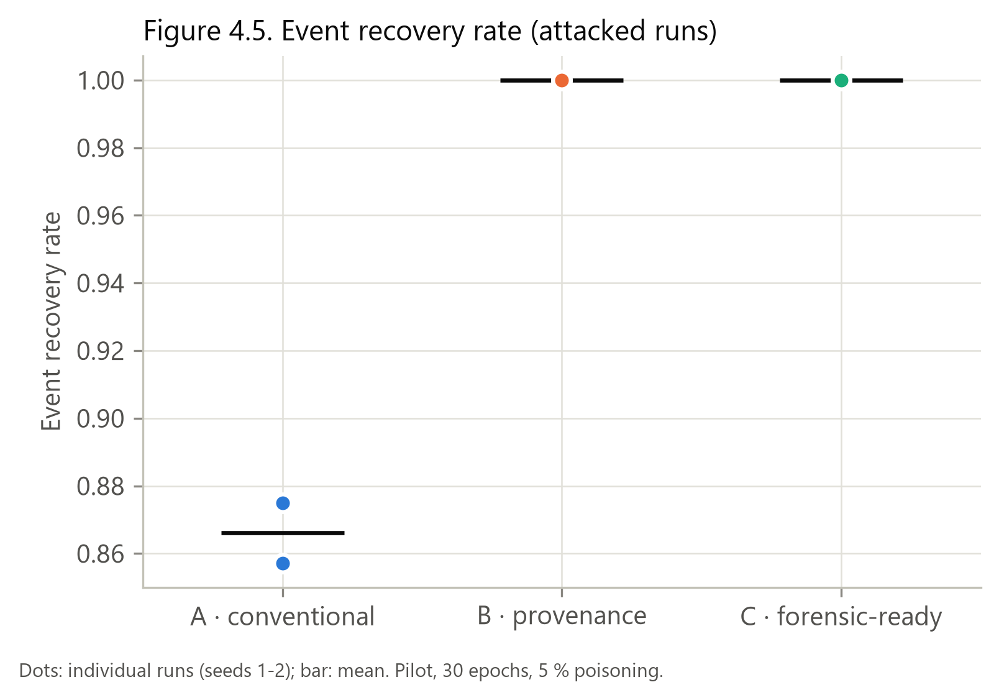

*Figure 4.5. Event recovery rate by pipeline (attacked runs)*

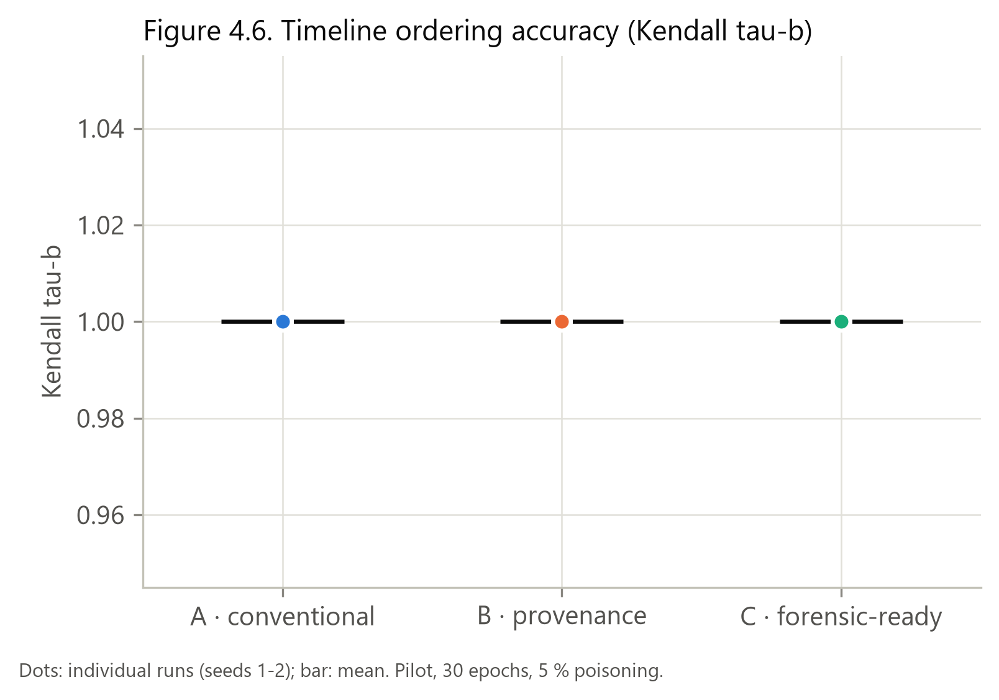

*Figure 4.6. Timeline ordering accuracy (Kendall τ-b) by pipeline*

### 7.2 Evidence relationships used (backward trace)

Link confidence: STRONG = cryptographic hash or explicit ID recorded at the event; MODERATE = recorded ID/path link or native MLflow lineage; WEAK = time ordering or paths only; NONE = unknown. The pattern was identical in every attacked run of a pipeline.

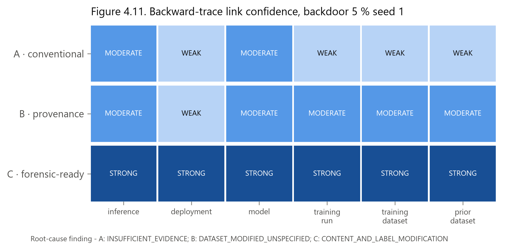

*Figure 4.11. Backward-trace link confidence, backdoor 5 % seed 1 (A/B/C)*

Full ground-truth vs reconstructed event sequences for the matched incident (backdoor 5 %, seed 1) under A, B and C are in `results/chapter4/reconstruction_case_study.md`. Summary of that incident:

|  | A | B | C |
|---|---|---|---|
| Evidence completeness | 50 % | 70 % | 100 % |
| Event recovery | 0.875 | 1.000 | 1.000 |
| Kendall τ-b | 1.000 | 1.000 | 1.000 |
| Root-cause finding | INSUFFICIENT_EVIDENCE | DATASET_MODIFIED_UNSPECIFIED | CONTENT_AND_LABEL_MODIFICATION |
| Changed samples identified (F1) | 0.00 | 0.00 | 1.00 |
| Reconstruction time (s) | 0.312 | 0.345 | 0.386 |

## 8. RQ3: Root-cause identification and reconstruction time

RCI score = correct components / 4 (dataset, training run, model, poisoning source at F1 ≥ 0.90). Deployment and attack-type identification are **not** components of the frozen schema; they are reported descriptively.

| Experiment | Dataset | Training run | Model | Poisoning source | RCI | Finding | Precision / recall / F1 | Deployment (descr.) | Attack type (descr.) |
|---|---|---|---|---|---|---|---|---|---|
| EXP-BD-A-05-S001 | 1 | 1 | 1 | 0 | 0.75 | INSUFFICIENT_EVIDENCE | – / 0.00 / 0.00 | 1 | 0 |
| EXP-BD-B-05-S001 | 1 | 1 | 1 | 0 | 0.75 | DATASET_MODIFIED_UNSPECIFIED | – / 0.00 / 0.00 | 1 | 0 |
| EXP-BD-C-05-S001 | 1 | 1 | 1 | 1 | 1.00 | CONTENT_AND_LABEL_MODIFICATION | 1.00 / 1.00 / 1.00 | 1 | 1 |
| EXP-BD-A-05-S002 | 1 | 1 | 1 | 0 | 0.75 | INSUFFICIENT_EVIDENCE | – / 0.00 / 0.00 | 1 | 0 |
| EXP-BD-B-05-S002 | 1 | 1 | 1 | 0 | 0.75 | DATASET_MODIFIED_UNSPECIFIED | – / 0.00 / 0.00 | 1 | 0 |
| EXP-BD-C-05-S002 | 1 | 1 | 1 | 1 | 1.00 | CONTENT_AND_LABEL_MODIFICATION | 1.00 / 1.00 / 1.00 | 1 | 1 |
| EXP-LF-A-05-S001 | 1 | 1 | 1 | 0 | 0.75 | INSUFFICIENT_EVIDENCE | – / 0.00 / 0.00 | 1 | 0 |
| EXP-LF-B-05-S001 | 1 | 1 | 1 | 0 | 0.75 | DATASET_MODIFIED_UNSPECIFIED | – / 0.00 / 0.00 | 1 | 0 |
| EXP-LF-C-05-S001 | 1 | 1 | 1 | 1 | 1.00 | LABEL_MODIFICATION | 1.00 / 1.00 / 1.00 | 1 | 1 |
| EXP-LF-A-05-S002 | 1 | 1 | 1 | 0 | 0.75 | INSUFFICIENT_EVIDENCE | – / 0.00 / 0.00 | 1 | 0 |
| EXP-LF-B-05-S002 | 1 | 1 | 1 | 0 | 0.75 | DATASET_MODIFIED_UNSPECIFIED | – / 0.00 / 0.00 | 1 | 0 |
| EXP-LF-C-05-S002 | 1 | 1 | 1 | 1 | 1.00 | LABEL_MODIFICATION | 1.00 / 1.00 / 1.00 | 1 | 1 |

### 8.1 Clean-control investigations (natural misclassification tickets)

| Experiment | Finding | Correct | False attribution |
|---|---|---|---|
| EXP-CLEAN-A-00-S001 | INSUFFICIENT_EVIDENCE | False | False |
| EXP-CLEAN-B-00-S001 | NO_DATASET_MODIFICATION_FOUND | True | False |
| EXP-CLEAN-C-00-S001 | NO_DATASET_MODIFICATION_FOUND | True | False |
| EXP-CLEAN-A-00-S002 | INSUFFICIENT_EVIDENCE | False | False |
| EXP-CLEAN-B-00-S002 | NO_DATASET_MODIFICATION_FOUND | True | False |
| EXP-CLEAN-C-00-S002 | NO_DATASET_MODIFICATION_FOUND | True | False |

*'Correct' = NO_DATASET_MODIFICATION_FOUND (the pre-registered correct finding). A reports INSUFFICIENT_EVIDENCE, which is not a false attribution but is not scored as correct.*

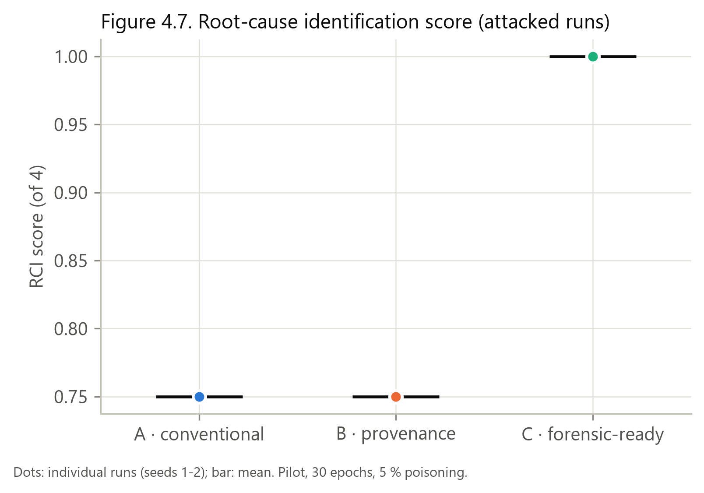

*Figure 4.7. Root-cause identification score by pipeline (attacked runs)*

### 8.2 Reconstruction time

| Experiment | Pipeline | Reconstruction time (s) |
|---|---|---|
| EXP-BD-A-05-S001 | A | 0.3119 |
| EXP-BD-A-05-S002 | A | 0.2145 |
| EXP-CLEAN-A-00-S001 | A | 0.2152 |
| EXP-CLEAN-A-00-S002 | A | 0.2060 |
| EXP-LF-A-05-S001 | A | 0.2351 |
| EXP-LF-A-05-S002 | A | 0.2150 |
| EXP-BD-B-05-S001 | B | 0.3454 |
| EXP-BD-B-05-S002 | B | 0.3791 |
| EXP-CLEAN-B-00-S001 | B | 0.3312 |
| EXP-CLEAN-B-00-S002 | B | 0.3730 |
| EXP-LF-B-05-S001 | B | 0.3824 |
| EXP-LF-B-05-S002 | B | 0.5628 |
| EXP-BD-C-05-S001 | C | 0.3859 |
| EXP-BD-C-05-S002 | C | 1.2245 |
| EXP-CLEAN-C-00-S001 | C | 0.4340 |
| EXP-CLEAN-C-00-S002 | C | 0.3835 |
| EXP-LF-C-05-S001 | C | 1.1953 |
| EXP-LF-C-05-S002 | C | 0.3544 |

| Pipeline | n | Mean (s) | Median (s) | SD | Min | Max |
|---|---|---|---|---|---|---|
| A | 6 | 0.2330 | 0.2151 | 0.0399 | 0.2060 | 0.3119 |
| B | 6 | 0.3957 | 0.3761 | 0.0843 | 0.3312 | 0.5628 |
| C | 6 | 0.6629 | 0.4099 | 0.4245 | 0.3544 | 1.2245 |

*Elapsed time of `reconstruct()` only (not training or inference). The B maximum (EXP-BD-B-05-S001) was the first MLflow query in the re-scoring process (client start-up); start/end wall-clock timestamps are not recorded.*

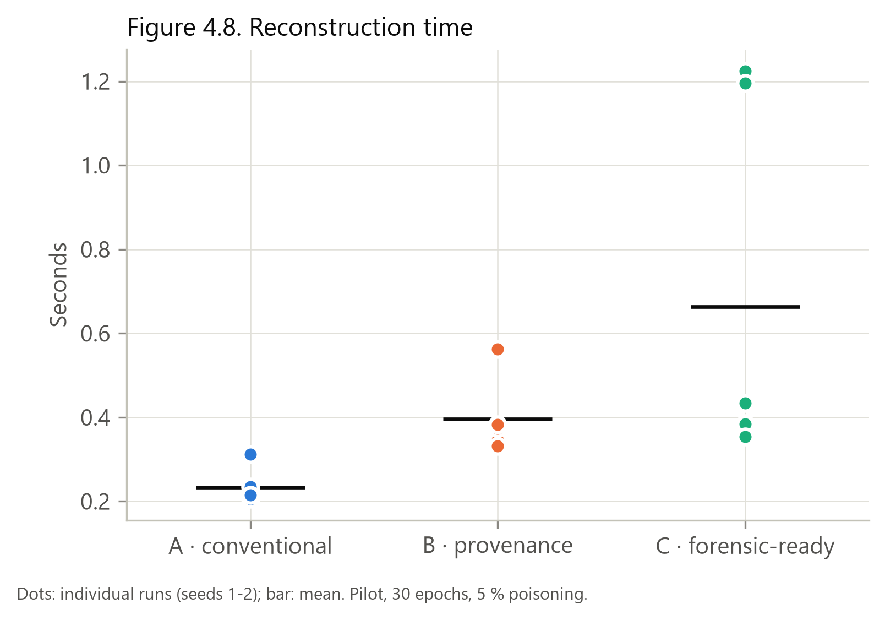

*Figure 4.8. Reconstruction time by pipeline*

## 9. RQ4: Storage and computational overhead

### 9.1 Evidence storage per run (MB)

| Experiment | Pipeline | Logs | Forensic SQLite | JSONL | Manifests | MLflow run artefacts | MLflow logged model | Other | Total excl. model | Total incl. MLflow model |
|---|---|---|---|---|---|---|---|---|---|---|
| EXP-BD-A-05-S001 | A | 0.038 | 0.000 | 0.000 | 0.000 | 0.0000 | NOT APPLICABLE | 0.017 | 0.055 | 0.055 |
| EXP-BD-A-05-S002 | A | 0.038 | 0.000 | 0.000 | 0.000 | 0.0000 | NOT APPLICABLE | 0.017 | 0.055 | 0.055 |
| EXP-CLEAN-A-00-S001 | A | 0.038 | 0.000 | 0.000 | 0.000 | 0.0000 | NOT APPLICABLE | 0.017 | 0.055 | 0.055 |
| EXP-CLEAN-A-00-S002 | A | 0.038 | 0.000 | 0.000 | 0.000 | 0.0000 | NOT APPLICABLE | 0.017 | 0.055 | 0.055 |
| EXP-LF-A-05-S001 | A | 0.038 | 0.000 | 0.000 | 0.000 | 0.0000 | NOT APPLICABLE | 0.017 | 0.055 | 0.055 |
| EXP-LF-A-05-S002 | A | 0.038 | 0.000 | 0.000 | 0.000 | 0.0000 | NOT APPLICABLE | 0.017 | 0.055 | 0.055 |
| EXP-BD-B-05-S001 | B | 0.038 | 0.000 | 0.000 | 0.000 | 0.0009 | 42.71 | 0.017 | 0.056 | 42.762 |
| EXP-BD-B-05-S002 | B | 0.038 | 0.000 | 0.000 | 0.000 | 0.0009 | 42.71 | 0.017 | 0.056 | 42.762 |
| EXP-CLEAN-B-00-S001 | B | 0.038 | 0.000 | 0.000 | 0.000 | 0.0009 | 42.71 | 0.017 | 0.056 | 42.762 |
| EXP-CLEAN-B-00-S002 | B | 0.038 | 0.000 | 0.000 | 0.000 | 0.0009 | 42.71 | 0.018 | 0.057 | 42.763 |
| EXP-LF-B-05-S001 | B | 0.038 | 0.000 | 0.000 | 0.000 | 0.0009 | 42.71 | 0.017 | 0.056 | 42.762 |
| EXP-LF-B-05-S002 | B | 0.038 | 0.000 | 0.000 | 0.000 | 0.0009 | 42.71 | 0.018 | 0.057 | 42.763 |
| EXP-BD-C-05-S001 | C | 0.038 | 0.336 | 0.384 | 10.660 | 0.0009 | 42.71 | 0.017 | 11.437 | 54.143 |
| EXP-BD-C-05-S002 | C | 0.038 | 0.340 | 0.384 | 10.660 | 0.0009 | 42.71 | 0.017 | 11.440 | 54.147 |
| EXP-CLEAN-C-00-S001 | C | 0.038 | 0.332 | 0.381 | 5.330 | 0.0009 | 42.71 | 0.017 | 6.100 | 48.806 |
| EXP-CLEAN-C-00-S002 | C | 0.038 | 0.332 | 0.381 | 5.330 | 0.0009 | 42.71 | 0.018 | 6.100 | 48.806 |
| EXP-LF-C-05-S001 | C | 0.038 | 0.336 | 0.384 | 10.660 | 0.0009 | 42.71 | 0.017 | 11.436 | 54.142 |
| EXP-LF-C-05-S002 | C | 0.038 | 0.336 | 0.384 | 10.660 | 0.0009 | 42.71 | 0.018 | 11.437 | 54.143 |

*Not counted: the CIFAR-10 download, model checkpoints used for serving (identical in all pipelines, 89.5 MB), the Python environment, and the shared MLflow metadata database (not attributable per run). Attacked C runs store two per-sample manifests (registered and observed); clean C runs store one.*

| Aggregate | Metric | n | Mean (MB) | SD | Δ vs A (MB) | Overhead vs A (%) |
|---|---|---|---|---|---|---|
| AGGREGATE A | evidence_total_mb | 6 | 0.055 | 0.000 | 0.000 | 0.0 |
| AGGREGATE B | evidence_total_mb | 6 | 0.056 | 0.000 | 0.001 | 2.2 |
| AGGREGATE C | evidence_total_mb | 6 | 9.658 | 2.756 | 9.603 | 17427.7 |
| AGGREGATE A | evidence_total_incl_mlflow_model_mb | 6 | 0.055 | 0.000 | 0.000 | 0.0 |
| AGGREGATE B | evidence_total_incl_mlflow_model_mb | 6 | 42.762 | 0.000 | 42.707 | 77504.1 |
| AGGREGATE C | evidence_total_incl_mlflow_model_mb | 6 | 52.364 | 2.756 | 52.309 | 94929.6 |

*Percentages are relative to A's very small evidence (≈ 0.055 MB), so absolute MB are the meaningful comparison.*

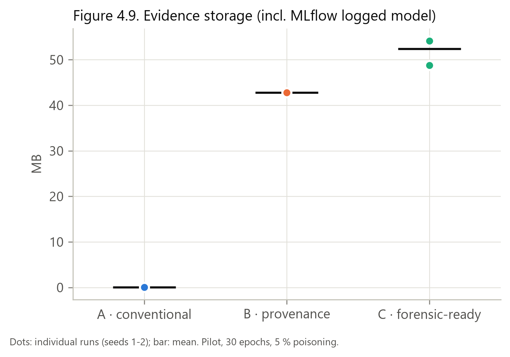

*Figure 4.9. Evidence storage by pipeline (incl. MLflow logged model)*

### 9.2 Computational overhead per run

| Experiment | Pipeline | Training (s) | Total pipeline (s) | Evidence logging (s) | Inference (s) | Median epoch (s) | Power state | Δ training vs matched A (%) | Peak RAM (MB) | Peak GPU (MB) | Mean CPU (%) |
|---|---|---|---|---|---|---|---|---|---|---|---|
| EXP-BD-A-05-S001 | A | 766.1 | 777.6 | 0.000 | 3.23 | 23.4 | full-power | 0.00 | 2179.6 | 765.5 | 103.3 |
| EXP-BD-B-05-S001 | B | 840.7 | 862.7 | 0.000 | 3.62 | 25.2 | full-power | 9.73 | 2228.4 | 765.5 | 105.2 |
| EXP-BD-C-05-S001 | C | 749.8 | 780.5 | 5.396 | 9.78 | 23.0 | full-power | -2.13 | 2233.7 | 765.5 | 106.7 |
| EXP-BD-A-05-S002 | A | 778.9 | 790.5 | 0.000 | 2.99 | 22.9 | full-power | 0.00 | 2146.4 | 765.5 | 100.4 |
| EXP-BD-B-05-S002 | B | 757.8 | 777.3 | 0.000 | 2.80 | 22.8 | full-power | -2.71 | 2236.5 | 765.5 | 104.1 |
| EXP-BD-C-05-S002 | C | 851.4 | 889.9 | 6.924 | 11.99 | 27.2 | reduced-power | 9.31 | 2210.6 | 765.5 | 102.1 |
| EXP-CLEAN-A-00-S001 | A | 740.5 | 747.8 | 0.000 | 3.07 | 22.6 | full-power | 0.00 | 2158.3 | 765.5 | 104.3 |
| EXP-CLEAN-B-00-S001 | B | 738.0 | 757.4 | 0.000 | 2.59 | 22.2 | full-power | -0.35 | 2160.0 | 765.5 | 107.2 |
| EXP-CLEAN-C-00-S001 | C | 715.2 | 744.5 | 5.093 | 9.31 | 22.3 | full-power | -3.42 | 2121.6 | 765.5 | 109.3 |
| EXP-CLEAN-A-00-S002 | A | 712.7 | 720.4 | 0.000 | 2.85 | 21.9 | full-power | 0.00 | 2153.8 | 765.5 | 102.3 |
| EXP-CLEAN-B-00-S002 | B | 711.9 | 726.7 | 0.000 | 2.53 | 22.2 | full-power | -0.10 | 2085.7 | 765.5 | 105.8 |
| EXP-CLEAN-C-00-S002 | C | 724.7 | 749.6 | 5.549 | 9.74 | 22.3 | full-power | 1.69 | 2087.6 | 765.5 | 105.5 |
| EXP-LF-A-05-S001 | A | 766.9 | 777.4 | 0.000 | 3.59 | 23.9 | full-power | 0.00 | 2298.9 | 765.5 | 103.0 |
| EXP-LF-B-05-S001 | B | 714.0 | 726.8 | 0.000 | 2.45 | 21.8 | full-power | -6.90 | 2233.9 | 765.5 | 105.4 |
| EXP-LF-C-05-S001 | C | 837.0 | 879.8 | 7.058 | 12.26 | 22.3 | full-power | 9.13 | 2232.7 | 765.5 | 98.7 |
| EXP-LF-A-05-S002 | A | 764.1 | 774.1 | 0.000 | 2.73 | 23.6 | full-power | 0.00 | 2181.1 | 765.5 | 102.7 |
| EXP-LF-B-05-S002 | B | 729.7 | 747.2 | 0.000 | 3.87 | 22.5 | full-power | -4.51 | 2233.1 | 765.5 | 106.5 |
| EXP-LF-C-05-S002 | C | 808.1 | 835.9 | 4.038 | 7.87 | 22.9 | full-power | 5.75 | 2233.4 | 765.5 | 101.0 |

| Aggregate | Metric | n | Mean | SD | Min | Max |
|---|---|---|---|---|---|---|
| AGGREGATE B vs A (all matched pairs) | training_overhead_vs_matched_A_percent | 6 | -0.807 | 5.765 | -6.896 | 9.731 |
| AGGREGATE B vs A (all matched pairs) | total_overhead_vs_matched_A_percent | 6 | 0.241 | 5.981 | -6.508 | 10.939 |
| AGGREGATE B vs A (all matched pairs) | evidence_logging_time_s | 6 | 0.000 | 0.000 | 0.000 | 0.000 |
| AGGREGATE B vs A (power-state-matched pairs only) | training_overhead_vs_matched_A_percent | 6 | -0.807 | 5.765 | -6.896 | 9.731 |
| AGGREGATE B vs A (power-state-matched pairs only) | total_overhead_vs_matched_A_percent | 6 | 0.241 | 5.981 | -6.508 | 10.939 |
| AGGREGATE B vs A (power-state-matched pairs only) | evidence_logging_time_s | 6 | 0.000 | 0.000 | 0.000 | 0.000 |
| AGGREGATE C vs A (all matched pairs) | training_overhead_vs_matched_A_percent | 6 | 3.389 | 5.540 | -3.422 | 9.314 |
| AGGREGATE C vs A (all matched pairs) | total_overhead_vs_matched_A_percent | 6 | 6.285 | 5.919 | -0.446 | 13.170 |
| AGGREGATE C vs A (all matched pairs) | evidence_logging_time_s | 6 | 5.676 | 1.147 | 4.038 | 7.058 |
| AGGREGATE C vs A (power-state-matched pairs only) | training_overhead_vs_matched_A_percent | 5 | 2.204 | 5.276 | -3.422 | 9.133 |
| AGGREGATE C vs A (power-state-matched pairs only) | total_overhead_vs_matched_A_percent | 5 | 5.027 | 5.650 | -0.446 | 13.170 |
| AGGREGATE C vs A (power-state-matched pairs only) | evidence_logging_time_s | 5 | 5.427 | 1.086 | 4.038 | 7.058 |

*Overhead % = (T_pipeline − T_A) / T_A × 100 within the same condition and seed. All matched triples shared one GPU power state, so the matched comparison is valid; absolute times differ between triples because of the power state. Evidence logging time = time spent writing forensic events (C only).*

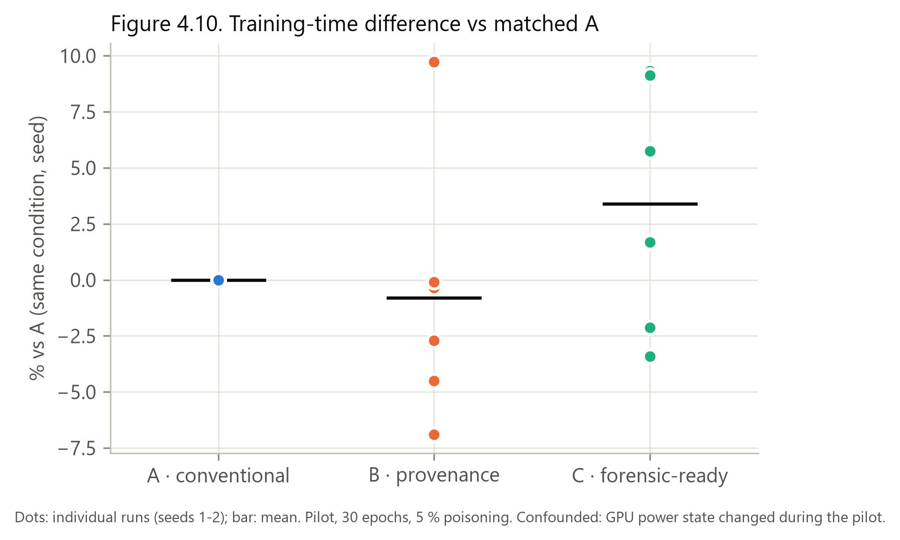

*Figure 4.10. Training-time difference vs matched A*

## 10. Statistical analysis (exploratory)

The design is paired: blocks = 3 conditions × 2 seeds = 6 (4 for attacked-only metrics), with A/B/C measured in every block. The assumption check was Shapiro–Wilk on within-block differences, choosing RM-ANOVA if normal and Friedman otherwise. Post hoc tests were paired t or Wilcoxon signed-rank with Holm correction. Binary outcomes used Cochran's Q plus exact McNemar tests. α = 0.05. Evidence metrics are largely deterministic given the design, so these tests mainly restate design differences; **n is too small for confirmatory inference.**

| Metric | Test | Statistic | df | p | p (Holm) | Effect size | Mean diff. | 95 % CI |
|---|---|---|---|---|---|---|---|---|
| evidence_completeness | Friedman | 12.000 | 2 | 0.0025 | – | Kendall's W = 1.000 | – | – |
| evidence_completeness | post hoc Wilcoxon signed-rank (A-B) | 0.000 |  | 0.0312 | 0.0938 | rank-biserial r = -1.000 | -0.1889 | -0.200 to -0.178 |
| evidence_completeness | post hoc Wilcoxon signed-rank (A-C) | 0.000 |  | 0.0312 | 0.0938 | rank-biserial r = -1.000 | -0.4815 | -0.500 to -0.463 |
| evidence_completeness | post hoc Wilcoxon signed-rank (B-C) | 0.000 |  | 0.0312 | 0.0938 | rank-biserial r = -1.000 | -0.2926 | -0.300 to -0.285 |
| event_recovery_rate | Friedman | 5.200 | 2 | 0.0743 | – | Kendall's W = 0.433 | – | – |
| event_recovery_rate | post hoc Wilcoxon signed-rank (A-B) | 0.000 |  | 0.1250 | 0.3750 | rank-biserial r = -1.000 | -0.0893 | -0.137 to -0.042 |
| event_recovery_rate | post hoc Wilcoxon signed-rank (A-C) | 5.000 |  | 0.6875 | 1.0000 | rank-biserial r = -0.400 | -0.0560 | -0.137 to 0.055 |
| event_recovery_rate | post hoc Wilcoxon signed-rank (B-C) | 0.000 |  | 1.0000 | 1.0000 | rank-biserial r = 1.000 | 0.0333 | 0.000 to 0.100 |
| timeline_kendall_tau_b | NOT RUN: no within-block variance (every pipeline difference is constant across blocks); inferential test not meaningful - report descriptively | – |  | – | – | – | – | – |
| rci_score | NOT RUN: no within-block variance (every pipeline difference is constant across blocks); inferential test not meaningful - report descriptively | – |  | – | – | – | – | – |
| reconstruction_seconds | Friedman | 10.333 | 2 | 0.0057 | – | Kendall's W = 0.861 | – | – |
| reconstruction_seconds | post hoc Wilcoxon signed-rank (A-B) | 0.000 |  | 0.0312 | 0.0938 | rank-biserial r = -1.000 | -0.1627 | -0.245 to -0.097 |
| reconstruction_seconds | post hoc Wilcoxon signed-rank (A-C) | 0.000 |  | 0.0312 | 0.0938 | rank-biserial r = -1.000 | -0.4299 | -0.730 to -0.139 |
| reconstruction_seconds | post hoc Wilcoxon signed-rank (B-C) | 4.000 |  | 0.2188 | 0.2188 | rank-biserial r = -0.619 | -0.2673 | -0.582 to 0.037 |
| evidence_storage_mb | Friedman | 12.000 | 2 | 0.0025 | – | Kendall's W = 1.000 | – | – |
| evidence_storage_mb | post hoc Wilcoxon signed-rank (A-B) | 0.000 |  | 0.0312 | 0.0938 | rank-biserial r = -1.000 | -0.0012 | -0.001 to -0.001 |
| evidence_storage_mb | post hoc Wilcoxon signed-rank (A-C) | 0.000 |  | 0.0312 | 0.0938 | rank-biserial r = -1.000 | -9.6032 | -11.383 to -7.824 |
| evidence_storage_mb | post hoc Wilcoxon signed-rank (B-C) | 0.000 |  | 0.0312 | 0.0938 | rank-biserial r = -1.000 | -9.6020 | -11.382 to -7.823 |
| training_seconds | repeated-measures ANOVA | 1.031 | 2, 10 | 0.3918 | – | partial eta^2 = 0.171 | – | – |
| training_seconds | post hoc paired t-test (A-B) | 0.344 | 5 | 0.7448 | 0.7448 | Cohen's d_z = 0.140 | 6.2082 | -27.910 to 33.069 |
| training_seconds | post hoc paired t-test (A-C) | -1.506 | 5 | 0.1925 | 0.5776 | Cohen's d_z = -0.615 | -26.1538 | -56.866 to 5.150 |
| training_seconds | post hoc paired t-test (B-C) | -0.980 | 5 | 0.3720 | 0.7440 | Cohen's d_z = -0.400 | -32.3620 | -87.435 to 26.624 |
| poisoning_source_identified | Cochran's Q | 8.000 | 2 | 0.0183 | – | – | – | – |
| poisoning_source_identified | McNemar exact (A-B): no discordant pairs | – |  | 1.0000 | 1.0000 | – | – | – |
| poisoning_source_identified | McNemar exact (A-C) | 0.000 |  | 0.1250 | 0.3750 | – | – | – |
| poisoning_source_identified | McNemar exact (B-C) | 0.000 |  | 0.1250 | 0.3750 | – | – | – |
| dataset_change_detected | Cochran's Q | 8.000 | 2 | 0.0183 | – | – | – | – |
| dataset_change_detected | McNemar exact (A-B) | 0.000 |  | 0.1250 | 0.3750 | – | – | – |
| dataset_change_detected | McNemar exact (A-C) | 0.000 |  | 0.1250 | 0.3750 | – | – | – |
| dataset_change_detected | McNemar exact (B-C): no discordant pairs | – |  | 1.0000 | 1.0000 | – | – | – |

*With 6 blocks the smallest exact Wilcoxon p is 0.031, so no pairwise comparison survives Holm correction. Kendall τ-b and the RCI score have no within-block variance, so no test is meaningful for them.*

## 11. Reconstruction engine version

This run used reconstruction engine v1.1 from the start (D-061: B's MLflow registration run is linked through the recorded registration-run ID). The engine v1.0 vs v1.1 comparison from the first run is archived in `archive/run1_2026-09-28/results/chapter4/rescoring_engine_v1_0_vs_v1_1.csv`.

## 12. Preliminary runs (excluded from the A/B/C analysis)

| Run | Type | Pipeline | Attack | Epochs | Clean acc. | ASR | Training (s) | Note |
|---|---|---|---|---|---|---|---|---|
| EXP-CLEAN-A-00-S001 | clean-baseline script | A | CLEAN | 30 | 0.9334 | - | 680.7 | model a57d5e956120; peak RAM 1722.0 MB |
| attack_sanity_backdoor_S001 | development check (no pipeline) | none | BD 5 % | 30 | 0.9316 | 1.0000 | 671.6 | 9000/9000 triggered images -> target |

- **Calibration** (planning only): AMP 54 ms/step (~21 s/epoch); fp32 103 ms/step (~40 s/epoch).

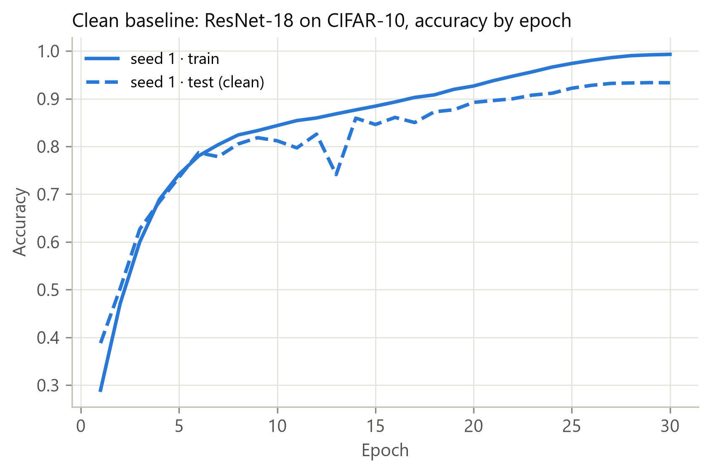

*Clean baseline accuracy by epoch (clean-baseline script, seed 1)*

## 13. Pre-stated hypotheses vs observed data (descriptive; exploratory statistics)

| Hypothesis (docs/hypotheses.md) | Observed | Descriptive outcome |
|---|---|---|
| H1.1 EC(A) < EC(B) < EC(C) | 50.0 < 70.0 < 100.0 % | consistent |
| H1.2 largest B→C gains in integrity and inference | B misses DS5, MO2, IN2, IN3, IG1, IG3; B recovers integrity 1/3 (IG2, post-hoc hashing only) and inference 1/3 (IN1); C recovers all | consistent |
| H2.1 ERR lower for A (dataset modification unobservable) | A 0.866 vs B 1.000, C 1.000; A misses POISONED_DATASET_CREATED | consistent |
| H2.2 ordering accurate in all pipelines | Kendall τ-b = 1.000 in all 18 runs | consistent |
| H3.1 only C identifies the poisoning source | F1 = 1.0 (C, 4/4); 0 (A, B) | consistent |
| H3.2 B detects the change but not the samples | B: DATASET_MODIFIED_UNSPECIFIED in 4/4 (engine v1.1) | consistent |
| H3.3 RCI(C) > RCI(B) ≥ RCI(A) | 1.00 > 0.75 = 0.75 | consistent |
| H3.4 no false attribution in clean controls | 0/6 false attributions | consistent |
| H3.5 RT(A) < RT(B) < RT(C) | medians 0.215 < 0.376 < 0.410 s | consistent (medians) |
| H4.1 small training-time overhead | B -0.8 %, C 3.4 % (repeated-measures ANOVA p = 0.39) | consistent (no measurable overhead) |
| H4.2 storage dominated by the MLflow model copy | B 42.8 MB (0.056 MB excl. model); C 52.4 MB (9.7 MB excl. model) | consistent |

*“Consistent” is descriptive. With 6 blocks no pairwise difference is statistically confirmed after Holm correction (§10).*

## 14. Design figures (no data)

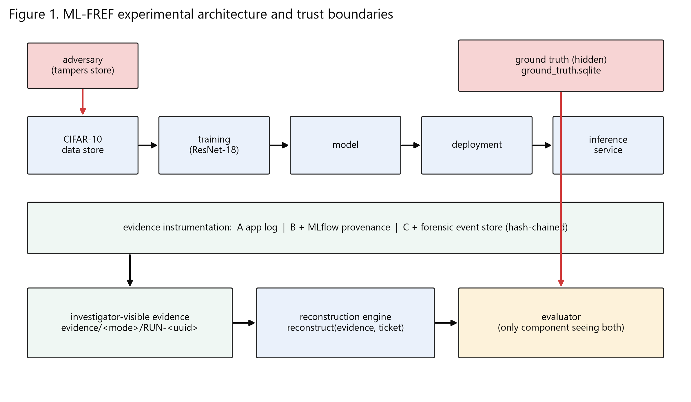

*Figure 1. ML-FREF architecture and trust boundaries*

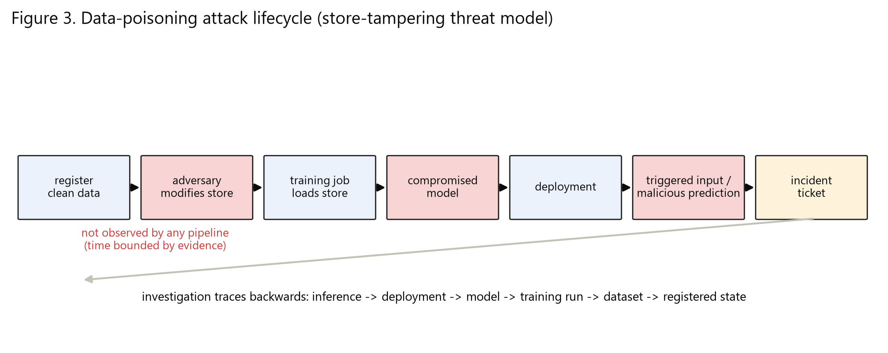

*Figure 3. Poisoning attack lifecycle*

## 15. Limitations of these results

- Pilot scale: 2 seeds and one poisoning rate (5 %), which gives no evidence on rate effects and too few blocks for confirmatory statistics.
- Evidence metrics are deterministic given the pipeline design: they measure what each evidence configuration can support, not a random quantity.
- Single machine (laptop GPU). Absolute runtimes of the first 6 runs were affected by a reduced GPU power state; matched comparisons are unaffected.
- Pipeline A's dataset identification relies on the 'content at event time' path rule (D-054), the most generous reading for path-only evidence.
- MLflow's dataset digest covers only the first 10,000 values per array and reuses records across runs (D-032, D-060). B's results depend on these MLflow properties.
- Evidence tampering is outside the threat model. The hash chain provides tamper evidence only (D-037).
- Results use engine v1.1 after a pilot-detected defect. v1.0 results are preserved (§11).
- Incorrectly inferred (false-positive) events are not measured.

## 16. Source files

All tables: `results/chapter4/*.csv` (per-value provenance in `results_provenance.csv`); run packages: `experiments/pilot/pipeline_runs/`; run index: `results/raw/run_index.csv`; failures: `results/raw/failed_runs.csv`; decisions: `docs/methodology_decisions.md` (D-001–D-061); hypotheses: `docs/hypotheses.md`.

## 17. Reproducibility: this run vs the archived first run (2026-09-28)

Same code version of the pipeline, same seeds, same data (official files re-verified by SHA-256), same machine; both scored with engine v1.1 (first run re-scored). Model hashes are compared from the run packages.

| Experiment | CA run 1 | CA run 2 | ASR run 1 | ASR run 2 | EC run 1 | EC run 2 | RCI run 1 | RCI run 2 | Same model hash | Same metrics | Train s run 1 | Train s run 2 |
|---|---|---|---|---|---|---|---|---|---|---|---|---|
| EXP-BD-A-05-S001 | 0.9316 | 0.9316 | 1.0000 | 1.0000 | 0.500 | 0.500 | 0.75 | 0.75 | yes | yes | 677.1 | 766.1 |
| EXP-BD-B-05-S001 | 0.9316 | 0.9316 | 1.0000 | 1.0000 | 0.700 | 0.700 | 0.75 | 0.75 | yes | yes | 685.1 | 840.7 |
| EXP-BD-C-05-S001 | 0.9316 | 0.9316 | 1.0000 | 1.0000 | 1.000 | 1.000 | 1.00 | 1.00 | yes | yes | 685.5 | 749.8 |
| EXP-BD-A-05-S002 | 0.9339 | 0.9339 | 1.0000 | 1.0000 | 0.500 | 0.500 | 0.75 | 0.75 | yes | yes | 687.1 | 778.9 |
| EXP-BD-B-05-S002 | 0.9339 | 0.9339 | 1.0000 | 1.0000 | 0.700 | 0.700 | 0.75 | 0.75 | yes | yes | 690.5 | 757.8 |
| EXP-BD-C-05-S002 | 0.9339 | 0.9339 | 1.0000 | 1.0000 | 1.000 | 1.000 | 1.00 | 1.00 | yes | yes | 679.8 | 851.4 |
| EXP-CLEAN-A-00-S001 | 0.9334 | 0.9334 | – | – | 0.556 | 0.556 | – | – | yes | yes | 1123.6 | 740.5 |
| EXP-CLEAN-B-00-S001 | 0.9334 | 0.9334 | – | – | 0.722 | 0.722 | – | – | yes | yes | 1014.5 | 738.0 |
| EXP-CLEAN-C-00-S001 | 0.9334 | 0.9334 | – | – | 1.000 | 1.000 | – | – | yes | NO | 1002.3 | 715.2 |
| EXP-CLEAN-A-00-S002 | 0.9284 | 0.9284 | – | – | 0.556 | 0.556 | – | – | yes | yes | 666.3 | 712.7 |
| EXP-CLEAN-B-00-S002 | 0.9284 | 0.9284 | – | – | 0.722 | 0.722 | – | – | yes | yes | 675.5 | 711.9 |
| EXP-CLEAN-C-00-S002 | 0.9284 | 0.9284 | – | – | 1.000 | 1.000 | – | – | yes | yes | 677.0 | 724.7 |
| EXP-LF-A-05-S001 | 0.9011 | 0.9011 | – | – | 0.500 | 0.500 | 0.75 | 0.75 | yes | yes | 1011.5 | 766.9 |
| EXP-LF-B-05-S001 | 0.9011 | 0.9011 | – | – | 0.700 | 0.700 | 0.75 | 0.75 | yes | yes | 993.1 | 714.0 |
| EXP-LF-C-05-S001 | 0.9011 | 0.9011 | – | – | 1.000 | 1.000 | 1.00 | 1.00 | yes | yes | 954.7 | 837.0 |
| EXP-LF-A-05-S002 | 0.9016 | 0.9016 | – | – | 0.500 | 0.500 | 0.75 | 0.75 | yes | yes | 678.5 | 764.1 |
| EXP-LF-B-05-S002 | 0.9016 | 0.9016 | – | – | 0.700 | 0.700 | 0.75 | 0.75 | yes | yes | 694.2 | 729.7 |
| EXP-LF-C-05-S002 | 0.9016 | 0.9016 | – | – | 1.000 | 1.000 | 1.00 | 1.00 | yes | yes | 700.5 | 808.1 |

Identical model SHA-256 in 18/18 runs; identical accuracy, attack, evidence and reconstruction metrics in 17/18 runs. Training times are not expected to match (GPU power state and system load are not controlled).
